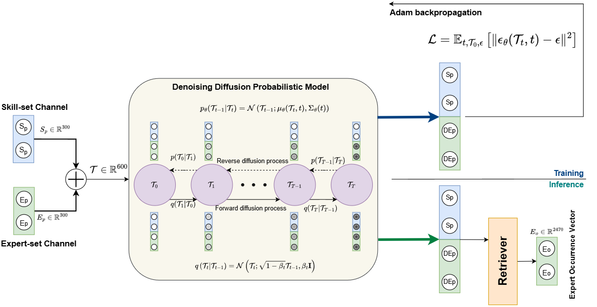

# DiffTF

This repository contains the official implementation for the paper: *Diffusion-Based Generative Modeling for Expert Team Formation*.

Our work introduces a novel generative approach for expert team formation using denoising diffusion probabilistic models (DDPMs). We frame team formation as a conditional inpainting task, where the model learns to generate a team of experts conditioned on a given set of skill requirements. This method effectively addresses challenges like data sparsity and generalization to new skill combinations.


This README is structured to help you understand the proposed approach, how to run the code, and the key contributions of our work as follows:

- [Proposed Approach](#proposed-approach)
- [Running the Code](#running-the-code)
  - [Data Preparation](#data-preparation)
  - [Environment Setup](#environment-setup)
  - [Training the Model](#training-the-model)
  - [Forming Expert Teams](#forming-expert-teams)
- [Key Contributions](#key-contributions)
- [Results](#results)
- [Abstract](#abstract)
- [License](#license)

## Proposed Approach

Our framework leverages a skill-conditioned diffusion model to generate expert teams. The core of our model is a U-Net architecture that learns to reverse a noise-corruption process.

1.  **Embedding**: We first create dense vector embeddings for skills and experts using Word2Vec to handle the high-dimensional, sparse nature of the data.
2.  **Concatenation**: For each training instance, the skill and expert vectors are concatenated into a single input vector.
3.  **Forward Diffusion**: Gaussian noise is incrementally added to the input vector over a series of timesteps, gradually corrupting it.
4.  **Reverse Denoising (Inpainting)**: The U-Net model is trained to predict and remove the noise from the corrupted vector. Crucially, during inference, we treat this as an inpainting task. The skill vector is known and fixed (with appropriate noise for the timestep), while the expert vector is generated from pure noise, conditioned on the skills.
5.  **Retrieval**: The final denoised expert embedding is used to retrieve the most suitable experts via a nearest-neighbor search in the expert embedding space.




## Running the Code
In this section, we provide instructions on how to set up the environment, run the training and evaluation scripts, and understand the dataset structure.

first, you need to clone the repository:

```bash
git clone https://github.com/sadjadeb/DiffTF.git
cd DiffTF/
```

### Data Preparation
We use two benchmark datasets for evaluation:

* **DBLP**: A bibliographic dataset where authors form teams for publications, and skills are extracted from paper titles.
* **DOTA2**: A dataset from the popular video game, where teams of players (experts) are formed for matches, and skills are derived from in-game features.

The pre-processed data and scripts to prepare it can be found in the `/data` directory of the repository. The dataset files are structured as follows:

```
dataset/
├── dblp/
   ├── ae_t2v_dimSkill300_dimUser300_tFull_dataset_V2.2.pkl
   ├── dblp_preprocessed_dataset_V2.3.pkl
   ├── Train_Test_indices_V2.3.pkl
├── dota2/
   ├── ae_t2v_dimSkill300_dimUser300_tFull_dota2.pkl
   ├── dota2_dataset.pkl
   ├── dota2_train_test_indices.pkl
```

### Environment Setup

To run this project, you need a Python environment with the following major libraries. You can install them using pip:

```bash
pip install -r requirements.txt
```

### Training the Model

The model is trained using the procedure outlined in Algorithm 1 of the paper. You can start the training process by running the main training script:

```bash
python main.py --dataset_name dblp\
               --device cuda\
               --training_steps 45000\
               --task train\
               --model_hidden_dim 256\
               --train_objective pred_noise\

```

Key arguments:
* `--dataset`: Specify `dblp` or `dota2`.
* `--device`: Set to `cuda` for GPU training or `cpu` for CPU training.
* `--training_steps`: Number of training steps (default is 45000).
* `--task`: Set to `train` for training the model.
* `--model_hidden_dim`: Dimension of the hidden layers in the U-Net model (default is 256).
* `--train_objective`: Set to `pred_noise` for the noise prediction objective. The other option is `pred_x0`, which trains the model to predict the original input from the noisy version directly.

### Forming Expert Teams

#### Inpainting

Once the model is trained, you can run inference to generate expert teams for a given set of skills. The inference process follows Algorithm 2 from the paper.

```bash
python main.py --dataset_name dblp\
               --device cuda\
               --task inpaint\
               --inpainting_strategy x_t\
               --trained_model <path_to_trained_model>\
```

#### Retrieval

To retrieve the top-k experts for a given skill set from the generated embeddings, you can use the retrieval script:

```bash
python retrieval.py --dataset_name dblp\
                    --inpainted_embeddings <path_to_inpainted_embeddings>\                           --k_fold 10\
                    --k_max 100\
``` 

Key arguments:
* `--dataset_name`: Specify `dblp` or `dota2`.
* `--inpainted_embeddings`: Path to the inpainted embeddings generated by the model.
* `--k_fold`: Number of folds for cross-validation (default is 10).
* `--k_max`: Maximum number of experts to retrieve (default is 100).

After running the retrieval script, you will get the top-k experts for each skill set in the dataset.


## Key Contributions

* **Novel Application of Diffusion Models**: We are the first to apply denoising diffusion models to the expert team formation task, formulating it as a conditional generative problem.
* **State-of-the-Art Performance**: Our model, DiffTF, significantly outperforms existing graph-based, probabilistic, and neural baselines on two real-world datasets (DBLP and DOTA2) across all standard retrieval metrics.
* **Robustness and Efficiency**: DiffTF demonstrates superior robustness, consistently improving results across a wide range of queries, and achieves a better trade-off between inference speed and accuracy compared to baselines.
* **Effective Generalization**: By combining dense embeddings for memorization and a diffusion generator for generalization, our model can form effective teams for both seen and unseen skill combinations.

## Results

Our model demonstrates a significant performance improvement over state-of-the-art baselines.

**Performance on the DBLP and DOTA2 datasets:**

| Dataset | Method        | Recall@10 | MRR@10     | MAP@10    | NDCG@10    |
|---------|---------------|--------|---------|--------|---------|
| **DBLP**| Sapienza et al.    | 2.14%  | 2.38%   | 0.93%  | 1.59%   |
|         | Rad et al.    | 5.03%  | 5.76%   | 2.19%  | 3.82%   |
|         | **DiffTF** | **16.41%** | **15.42%** | **9.73%** | **13.08%**|
| **DOTA2**| Sapienza et al.    | 2.45%  | 3.82%   | 0.75%  | 1.85%   |
|         | Rad et al.    | 5.03%  | 5.76%   | 2.19%  | 3.82%   |
|         | **DiffTF** | **4.00%** | **13.34%** | **2.67%** | **5.09%** |

For a detailed analysis, including performance curves, Help-Hurt diagrams, and efficiency trade-offs, please refer to Section 5 of our paper.


## Abstract

The task of expert team formation aims to select a group of individuals whose collective skills satisfy a given task's requirements. This task is complicated by sparse co-occurrence data, long-tailed expert participation, and the need for generalization to unseen skill combinations. We propose a novel generative approach based on denoising diffusion probabilistic models that formulates team formation as a conditional inpainting task. Our model learns to sample expert vectors conditioned by the skill set through denoising the expert portion of the input, preserving semantic alignment with task requirements. Dense embeddings mitigate sparsity, while the diffusion-based sampling process enables the generation of diverse and contextually plausible teams. Extensive experiments on real-world datasets demonstrate that our method achieves state-of-the-art performance in both retrieval quality and inference efficiency, outperforming existing graph-based, probabilistic, and neural methods.


## License

The code in this repository is released under the [MIT License](https://github.com/sadjadeb/DiffTF/blob/main/LICENSE).
